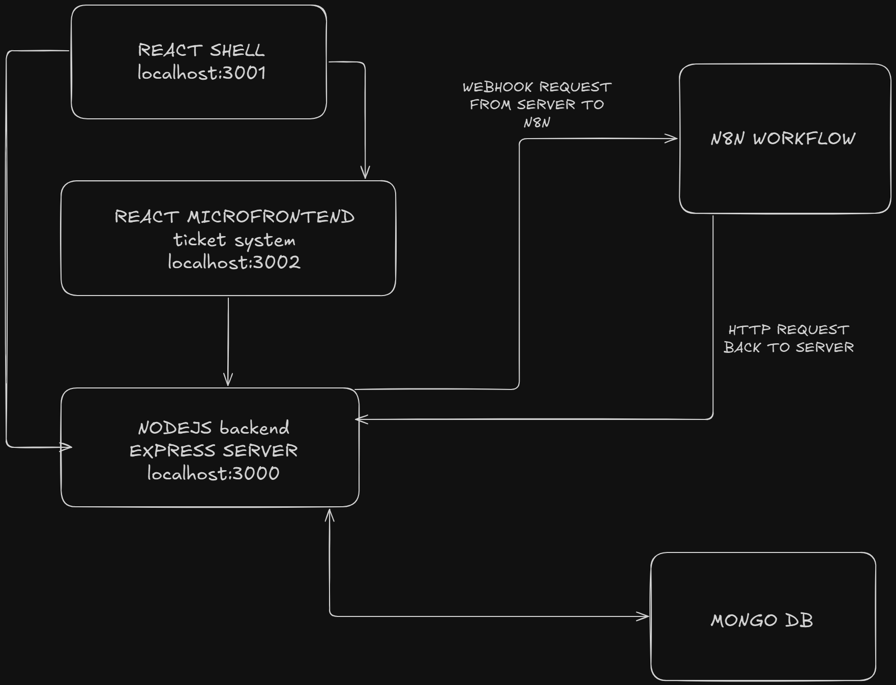

# Multi-Tenant Micro-Frontend Support Ticket Platform

A full-stack, containerized micro-frontend platform enabling multi-tenant ticketing management integrated with `n8n` workflows, JWT-based authentication, RBAC, and MongoDB tenant data isolation.

---

## 🚀 Features

- 🔐 JWT Authentication with Role-Based Access Control (RBAC)
- 🧩 Micro-Frontend Architecture using Module Federation
- 🏢 Multi-Tenant MongoDB Isolation
- 📩 Support Ticket System with Workflow Integration (`n8n`)
- 📬 Webhook Integration from `n8n` back to Flowbit
- 🐳 Fully Dockerized Environment

---

## 📁 Project Structure

```
flowbit/
├── api/                  # Express.js backend
├── shell/                # Main React shell
├── support-tickets/      # Micro-frontend for ticket system
├── docker-compose.yml    # Multi-container configuration
└── .env                  # Environment variables
```

---

## ⚙️ Tech Stack

- **Frontend:** React, Vite, Module Federation
- **Backend:** Node.js, Express.js, Mongoose
- **Database:** MongoDB (multi-tenant setup)
- **Workflow:** n8n (HTTP Webhook + HTTP Request)
- **Auth:** JWT, Middleware-based RBAC
- **Containerization:** Docker, Docker Compose

---
## 💡 Architecture Diagram




## 🛠️ Setup Instructions

### 1. Clone the Repository

```bash
git clone https://github.com/your-username/flowbit.git
cd flowbit
```

### 2. Configure Environment Variables

Create a `.env` file in the root and add:

```env
JWT_SECRET=your-super-secret-jwt-key
```

> MongoDB credentials and n8n basic auth are already configured inside `docker-compose.yml`.

### 3. Start the Application

```bash
docker compose up --build
```

- Shell (React host): [http://localhost:3001](http://localhost:3001)
- Support Tickets MFE: [http://localhost:3002](http://localhost:3002)
- Backend API: [http://localhost:3000](http://localhost:3000)
- n8n Workflow UI: [http://localhost:5678](http://localhost:5678)

---

## 🔁 Webhook Flow (n8n)

1. Webhook triggers when a ticket is created.
2. Timer waits a 10 seconds.
3. HTTP Request updates the ticket status (e.g., `in progress`).
4. Callback hits backend at `/webhook/ticket-done`.

### Example JSON (HTTP Request Node in n8n):

```json
{
  "ticketId": "={{$json.body.ticketId}}",
  "newStatus": "in progress"
}
```

---

## 🧹 Clearing All Tickets

To delete all tickets inside the running Mongo container:

```bash
docker exec -it flowbit-mongodb mongosh -u admin -p password --authenticationDatabase admin --eval "db = db.getSiblingDB('flowbit'); db.tickets.deleteMany({})"
```

---

## ⚠️ Note on UI/Styling

> This project prioritizes **functionality and architecture**. Styling, responsiveness, and UI polish have been intentionally **deprioritized**.

---

## 📄 .gitignore Highlights

```gitignore
**/node_modules/
**/.env
**/dist/
**/logs/
**/mongodb_data/
**/n8n_data/
.vscode/
.idea/
```

---

## 📦 Deployment Notes

- Set secure environment secrets using Docker secrets or environment vaults.
- Enable HTTPS and domain mapping in production.
- Use CI/CD for builds and `docker-compose -f docker-compose.prod.yml up` for deployments.
- Consider using Mongo Atlas and production-grade workflow hosting.

---

## 👥 Contributors

- Sutanu Jana — [GitHub](https://github.com/Sutanu01)

---

## 📃 License

MIT License